Task-1 Setup Repository

Kita clone terlebih dahulu repo github

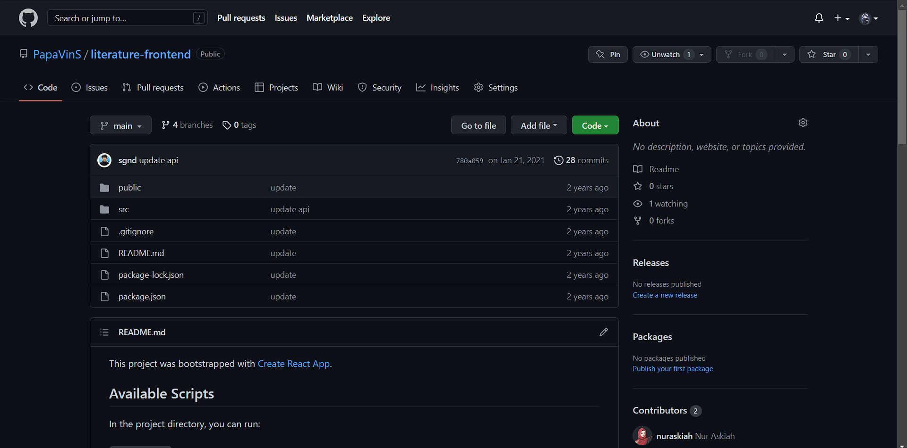{width="6.268055555555556in"
height="3.1013888888888888in"}

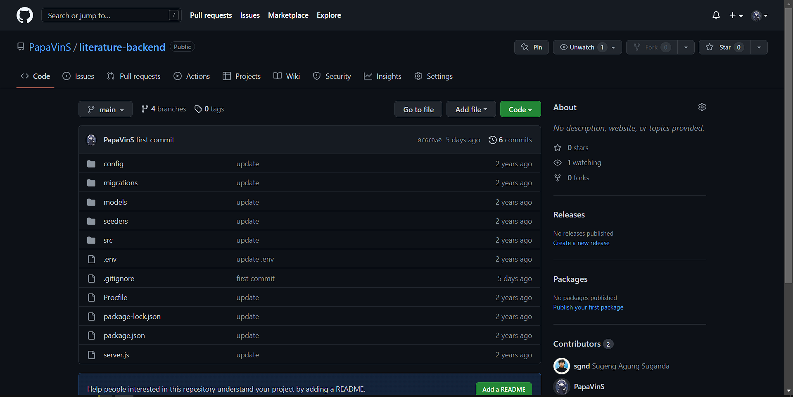{width="6.268055555555556in"
height="3.140277777777778in"}

Kemudian setup git config

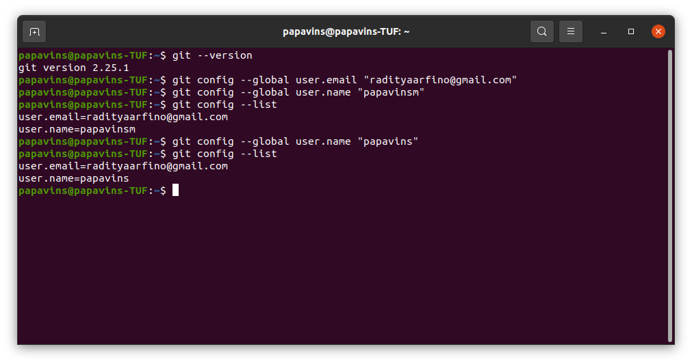{width="6.266666666666667in"
height="3.3in"}

Setup SSH key github

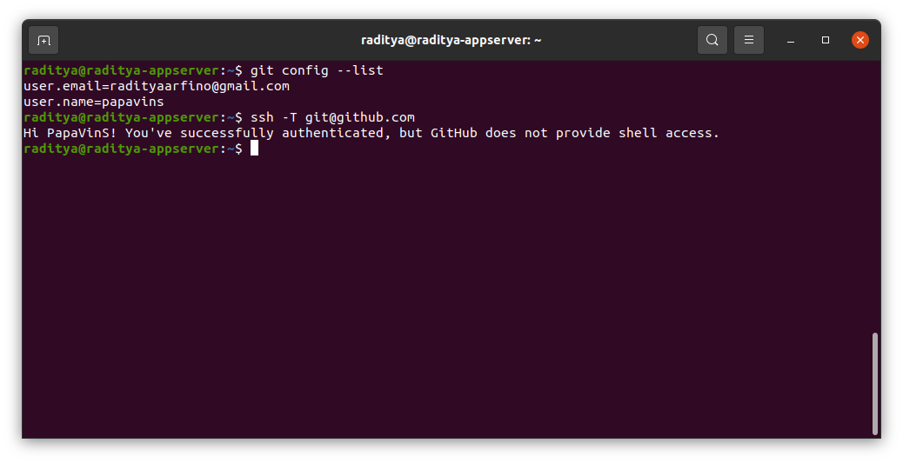{width="6.258333333333334in"
height="3.216666666666667in"}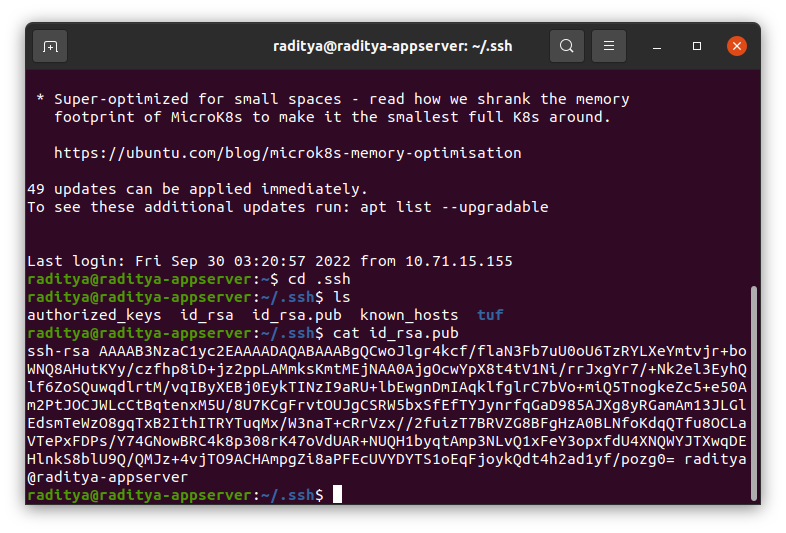{width="6.266666666666667in"
height="4.25in"}

Kita masuk direktori frontend dan backend lalu ubah remote githubnya

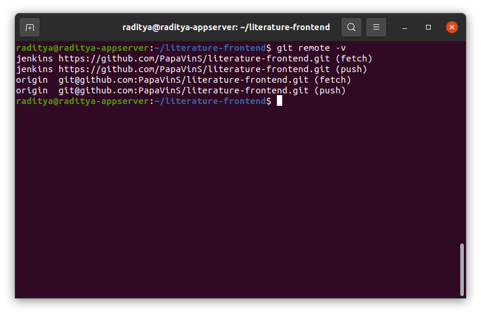{width="6.266666666666667in"
height="4.108333333333333in"}

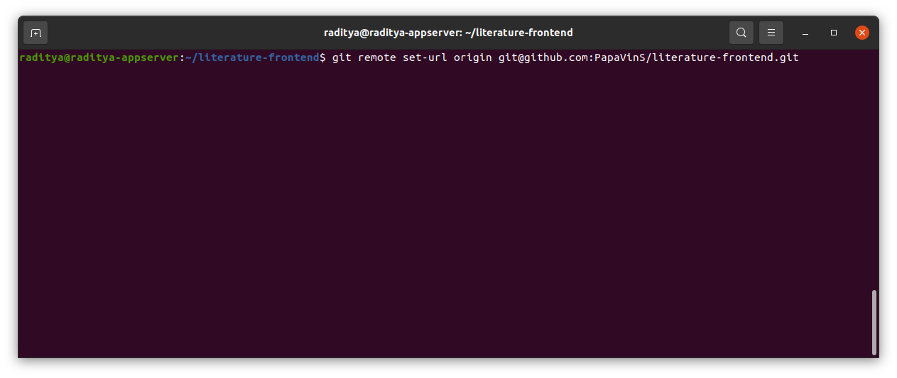{width="6.258333333333334in"
height="2.6416666666666666in"}

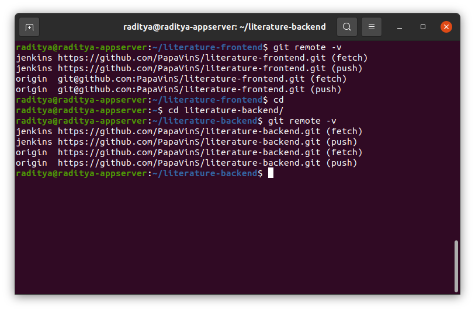{width="6.266666666666667in"
height="4.108333333333333in"}

Buat branch Development, Staging dan production

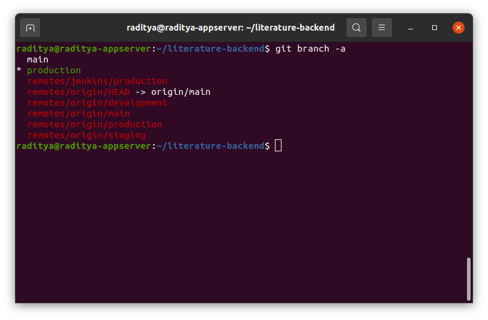{width="6.26875in"
height="4.111111111111111in"}

Task-2 Create Server

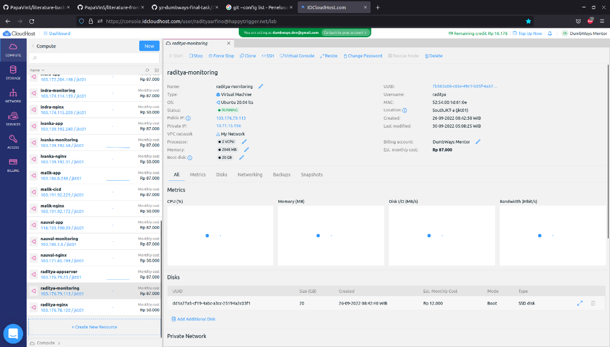{width="4.902777777777778in"
height="2.7914818460192476in"}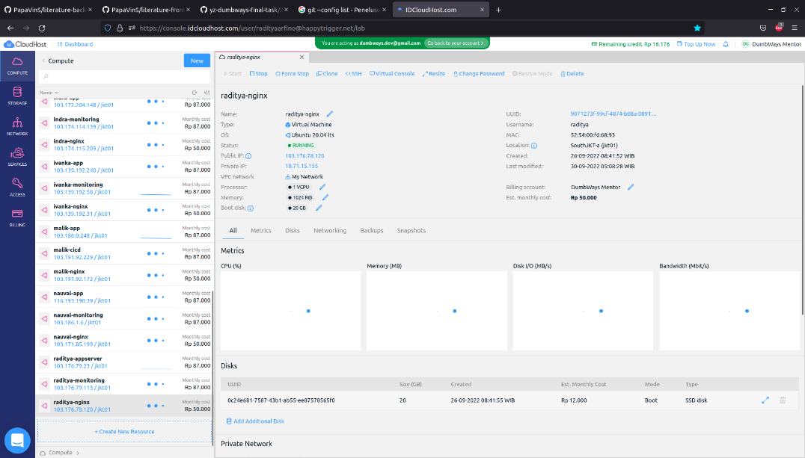{width="4.875in"
height="2.7756649168853893in"}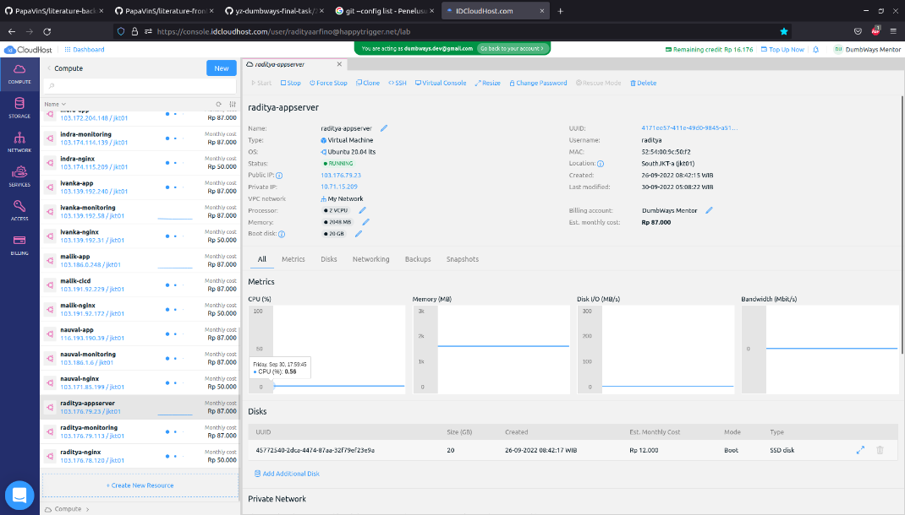{width="4.844557086614174in"
height="2.7583333333333333in"}

Task-3 User

Buat file inventory.yml

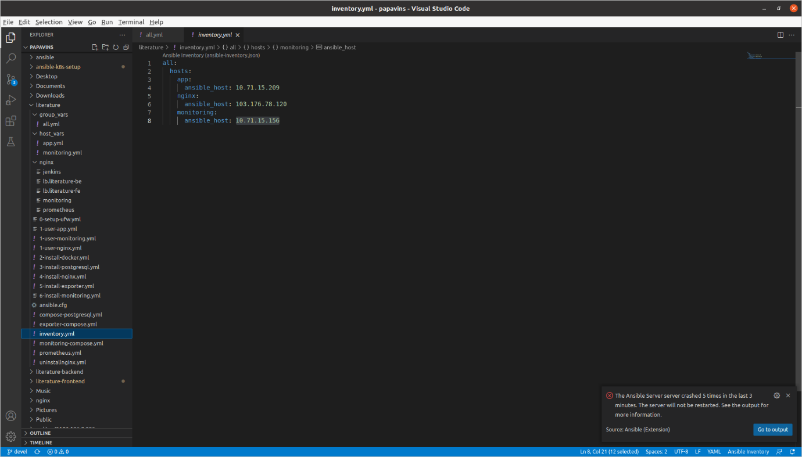{width="6.266666666666667in"
height="3.575in"}

Ansible.cfg

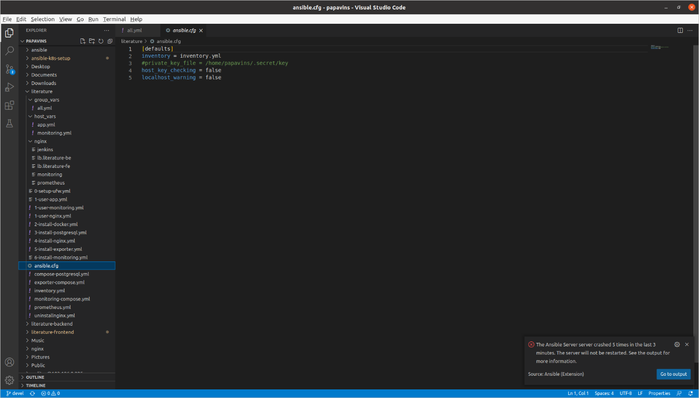{width="6.266666666666667in"
height="3.575in"}
