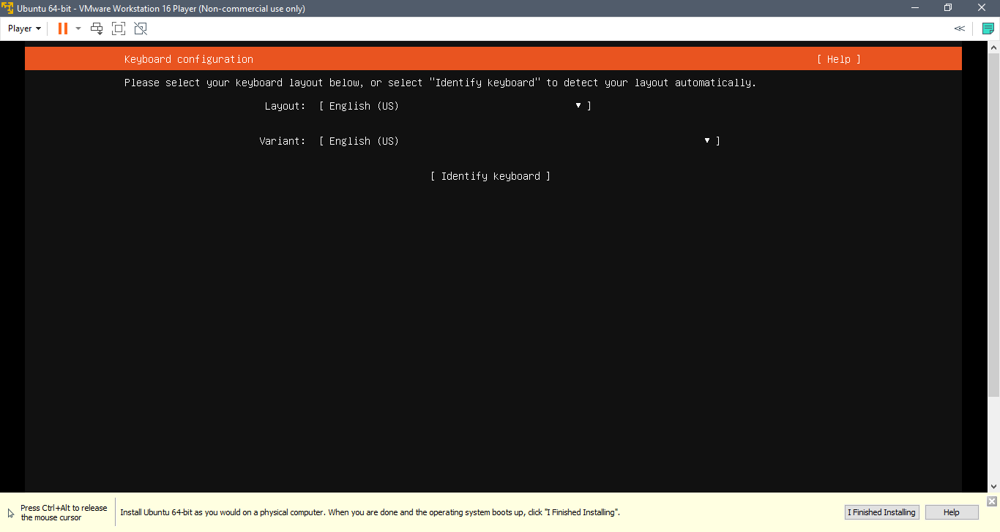
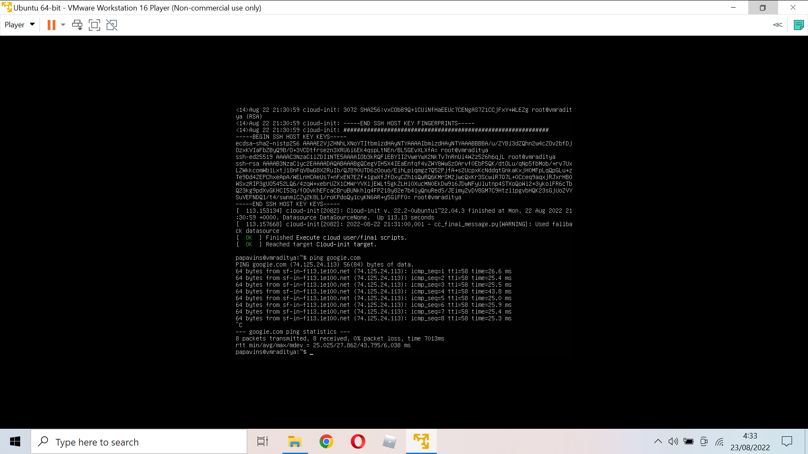

# Day 1

## Definisi DevOps

DevOps adalah gabungan orang, proses, dan teknologi untuk maintaining,
monitoring, dan developing infrastruktur pada suatu produk aplikasi

# Install Ubuntu Server

## Step 1

Download file iso ubuntu server
dari <https://ubuntu.com/download/server>

## Step 4

Pilih installer disc image file (iso) kemudian pilih file iso. Ubuntu
server yang akan diinstal lalu klik next.

## Step 5

Isikan nama virtual machine dan lokasi virtual machine

## Step 6

Kemudian atur kapasitas storage untuk virtual machine dan pilih split
virtual disk into multiple files

## Step 7

Klik customize hardware

## Step 8

Klik network adapter kemudian dibagian network connection pilih opsi
Bridged

## Step 9

Jalankan atau play virtual machine yang sudah dibuat

## Step 10

Pilih Try or install ubuntu server

## Step 11

Pilih Bahasa yang digunakan

## Step 12

Pilih layout keyboard

## Step 13

Pilih Ubuntu server

## Step 14

Pilih ens33 kemudian edit IPv4

## Step 15

IPv4 method pilih manual

## Step 16

Isikan subnet, address, gateway, name servers kemudian save

## Step 17

Bila sudah pilih Done

## Step 18

Isi proxy address bila digunakan

## Step 19

Isi mirror address bila menggunakan address alternatif

## Step 20

Pilih Custom storage layout

## Step 21

Tambah partisi baru dengan memilih free space kemudian add GPT partition

## Step 22

Isi size partition dan format untuk partisi root dan swap

## Step 23

Bila sudah pilih continue untuk memulai pembuatan partisi disk virtual
machine

## Step 24

Isi nama, nama server, username dan password

## Step 25

Pilih install OpenSSH server

## Step 26

Pilih package yang diperlukan untuk diinstal (untuk ini kita pilih
docker)

## Step 27

Bila sudah tunggu proses instalasi hingga selesai

## Step 28

Jika sudah maka kita login dengan username dan password kita tes koneksi
dengan command ping

