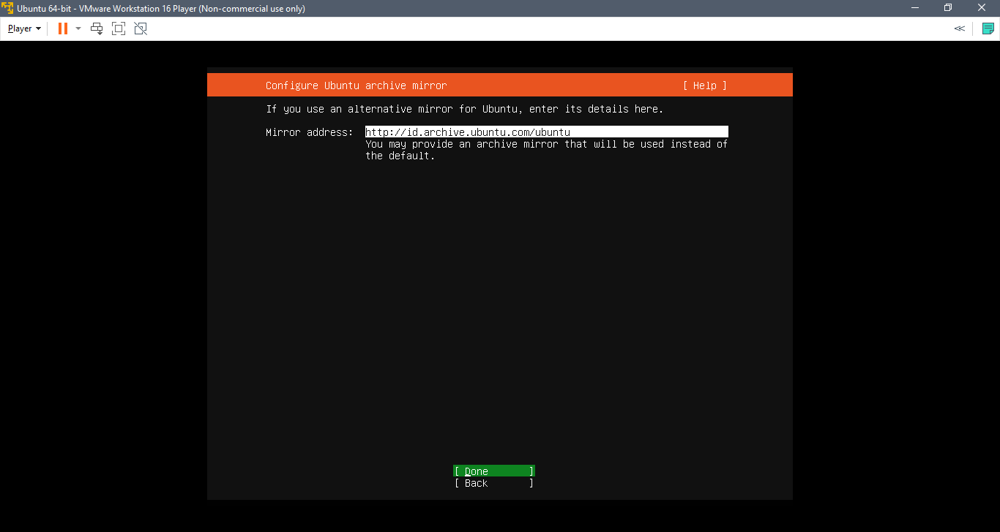

Day 1

Definisi DevOps

DevOps adalah gabungan orang, proses, dan teknologi untuk maintaining,
monitoring, dan developing infrastruktur pada suatu produk aplikasi

Install Ubuntu Server

Step 1

Download file iso ubuntu server
dari <https://ubuntu.com/download/server>

{width="4.06716426071741in"
height="2.6145734908136484in"}

Step 2

Download dan install VMware Workstation Player
https://www.vmware.com/products/workstation-player.html

{width="4.5373173665791775in"
height="2.0726082677165354in"}

Step 3

Buka VMware kemudian klik Create a new virtual machine

{width="4.805970034995625in"
height="3.9925371828521437in"}

Step 4

Pilih installer disc image file (iso) kemudian pilih file iso. Ubuntu
server yang akan diinstal lalu klik next.

{width="4.12411198600175in"
height="3.4260870516185475in"}

Step 5

Isikan nama virtual machine dan lokasi virtual machine

{width="4.55818460192476in"
height="3.7840004374453193in"}

Step 6

Kemudian atur kapasitas storage untuk virtual machine dan pilih split
virtual disk into multiple files

{width="4.25599956255468in"
height="3.533140857392826in"}

Step 7

Klik customize hardware

{width="4.36in"
height="3.619478346456693in"}

Step 8

Klik network adapter kemudian dibagian network connection pilih opsi
Bridged

{width="4.04in"
height="3.8594991251093616in"}

Step 9

Jalankan atau play virtual machine yang sudah dibuat

{width="4.806702755905512in"
height="3.88in"}

Step 10

Pilih Try or install ubuntu server

{width="4.12in"
height="2.962562335958005in"}

Step 11

Pilih Bahasa yang digunakan

{width="4.881765091863517in"
height="2.6in"}

Step 12

Pilih layout keyboard

{width="5.66400043744532in"
height="3.0166141732283465in"}

Step 13

Pilih Ubuntu server
{width="6.259722222222222in"
height="4.558333333333334in"}

Step 14

Pilih ens33 kemudian edit IPv4

{width="6.259722222222222in"
height="3.3375in"}

Step 15

IPv4 method pilih manual

{width="6.259722222222222in"
height="3.3375in"}

Step 16

Isikan subnet, address, gateway, name servers kemudian save

{width="6.259722222222222in"
height="3.3375in"}

Step 17

Bila sudah pilih Done

{width="6.259722222222222in"
height="3.3375in"}

Step 18

Isi proxy address bila digunakan

{width="6.259722222222222in"
height="3.3375in"}

Step 19

Isi mirror address bila menggunakan address alternatif

{width="6.259722222222222in"
height="3.3375in"}

Step 20

Pilih Custom storage layout

{width="6.259722222222222in"
height="3.3375in"}

Step 21

Tambah partisi baru dengan memilih free space kemudian add GPT partition

{width="6.259722222222222in"
height="3.3375in"}

Step 22

Isi size partition dan format untuk partisi root dan swap

{width="4.064935476815398in"
height="2.1673031496062993in"}

{width="4.110389326334208in"
height="2.191538713910761in"}

Step 23

Bila sudah pilih continue untuk memulai pembuatan partisi disk virtual
machine

{width="6.259722222222222in"
height="3.3375in"}

Step 24

Isi nama, nama server, username dan password

{width="6.259722222222222in"
height="3.3375in"}

Step 25

Pilih install OpenSSH server

{width="6.259722222222222in"
height="3.3375in"}

Step 26

Pilih package yang diperlukan untuk diinstal (untuk ini kita pilih
docker)

{width="6.259722222222222in"
height="3.3375in"}

Step 27

Bila sudah tunggu proses instalasi hingga selesai

{width="6.259722222222222in"
height="3.3375in"}

Step 28

Jika sudah maka kita login dengan username dan password kita tes koneksi
dengan command ping

{width="6.259722222222222in"
height="3.5194444444444444in"}{width="6.259722222222222in"
height="3.5194444444444444in"}
