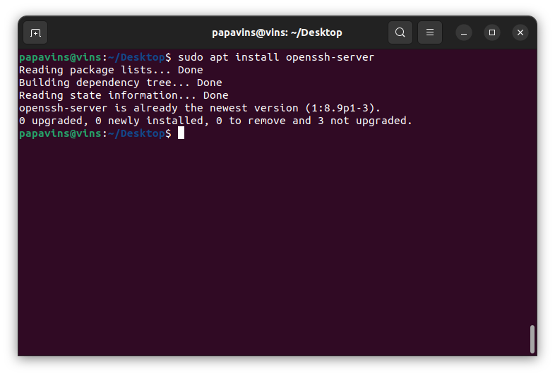

# Day 2

# Definisi Computer Network

Computer network adalah jaringan telekomunikasi antara computer yang
terhubung untuk saling bertukar data dan informasi.

# Contoh perintah linux yang digunakan untuk management server linux

## Ls

command ls berfungsi menampilkan list atau daftar file

## Mv

Command mv berfungsi untuk memindahkan atau rename suatu file

## Sudo

Perintah sudo atau "super user do" berfungsi untuk melakukan suatu
command sebagai

user root tanpa harus login ke user root

## Cp

Cp perintah untuk meng-copy file

## Chown

Chown berfungsi untuk merubah kepemilikan suatu file

## Usermod

Usermod digunakan untuk merubah informasi dari suatu user seperti group,

nama, lokasi home directory, dll

## Chmod

Command chmod berfungsi merubah permission atau izin akses suatu file

antara lain read, write, dan execute

# Merubah IP server ubuntu dan tes koneksi IP baru dengan SSH

# Step 1

Pertama kita install OpenSSH server terlebih dahulu dengan command sudo
apt install openssh-server

{width="5.226442475940507in"
height="3.544775809273841in"}

Bila proses instalasi selesai, aktifkan dahulu service SSH dengan
command

sudo systemctl enable ssh

{width="6.261111111111111in"
height="4.246527777777778in"}

Kemudian ubah permission UFW SSH menjadi allow agar remote server bisa
login dengan command sudo ufw allow ssh

{width="6.261111111111111in"
height="4.246527777777778in"}

# Step 2

Masukkan command sudo nano /etc/netplan/00-installer-config.yaml
{width="6.261111111111111in"
height="4.246527777777778in"}

# Step 3

Isikan parameter IP, gateway, dan DNS sesuai kebutuhan. Bila selesai
save dengan menekan ctrl+o atau exit dan save dengan menekan ctrl + X
lalu yes.

{width="6.261111111111111in"
height="4.246527777777778in"}

# Step 4

Kemudian apply parameter tadi yang sudah diisi dengan command

Sudo netplan apply

{width="6.261111111111111in"
height="4.246527777777778in"}

# Step 5

Login SSH dengan IP yang sudah dirubah tadi

Ssh <papavins@192.168.1.100>

{width="2.3805971128608925in"
height="4.760851924759405in"}

# Step 6

Lakukan tes koneksi dengan ping dan traceroute, bila traceroute belum
terinstall maka bisa menggunakan command

Sudo apt install inetutils-traceroute

{width="2.962687007874016in"
height="5.924948600174978in"}

#Instalasi Apache2 dan LocalTunnel

# Step 1

Install apache2 dengan command

sudo apt-get install apache2

{width="6.261111111111111in"
height="4.246527777777778in"}

# Step 2

Kemudian cek status keaktifan apache2, bila service apache2 berjalan
akan muncul status active (running). Masukkan command

systemctl status apache2

{width="6.261111111111111in"
height="4.246527777777778in"}

# Step 3

Cek apakah service apache2 berjalan dengan memasukkan IP melalui browser

{width="4.836111111111111in"
height="9.671527777777778in"}

# Step 4

Kemudian untuk instalasi localtunnel pastikan curl sudah terinstall
dengan command

Curl

{width="6.261111111111111in"
height="4.246527777777778in"}

Bila not found, lakukan instalasi curl dengan command

sudo apt-get install curl

{width="6.261111111111111in"
height="4.246527777777778in"}

# Step 5

Setelah itu install node.js agar localtunnel bisa menjalankan kodenya,
caranya dengan menginstall nvm dengan command

curl -o- https://raw.githubusercontent.com/nvm-sh/nvm/v0.39.1/install.sh
\| bash

{width="6.261111111111111in"
height="4.246527777777778in"}

# Step 6

Jika sudah install node versi 14 dengan command

nvm install 14

{width="5.534529746281715in"
height="3.753731408573928in"}

# Step 7

Kemudian cek versi node yang sudah terinstal dengan command

Npm -v

Node -v

{width="6.261111111111111in"
height="4.246527777777778in"}

# Step 8

Install localtunnel dengan command

npm install -g localtunnel

{width="6.261111111111111in"
height="4.246527777777778in"}

# Step 9

Buat tunnel http apache port 80 dengan command

lt \\\--port 80

{width="6.261111111111111in"
height="4.246527777777778in"}

# Step 10

Cek URL yang diberikan kedalam browser

{width="6.261111111111111in"
height="3.589583333333333in"}
