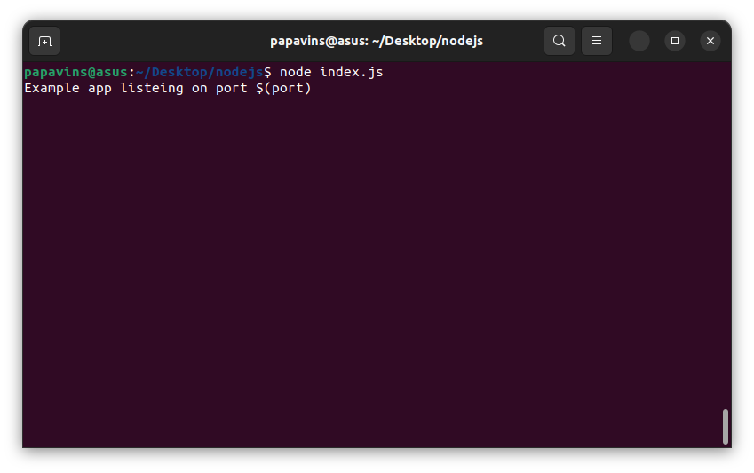
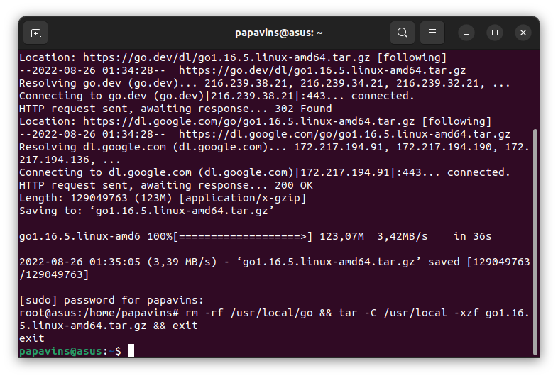
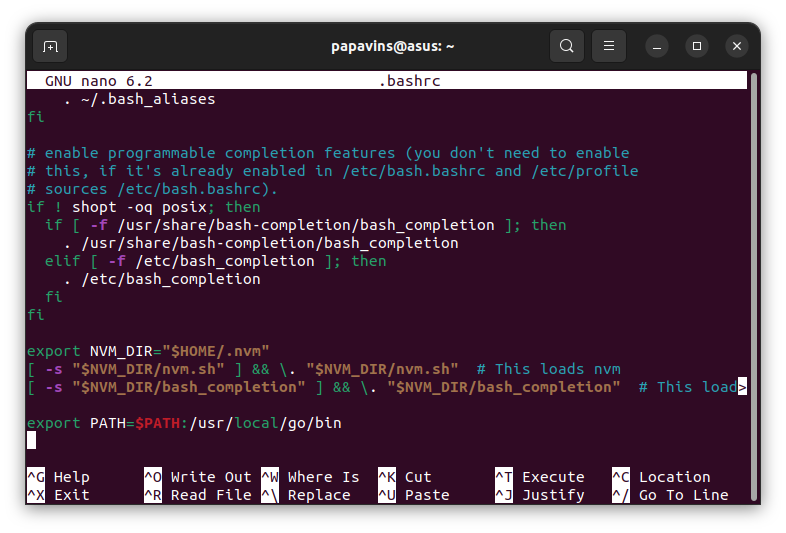

# Day 3

## Application

Definisi dari aplikasi adalah perangkat lunak yang dibuat untuk
mengerjakan fungsi tertentu yang dapat dioperasikan oleh pengguna

# Pembuatan aplikasi sederhana Node.js

## Step 1

Buat direktori untuk node.js dengan command

`Mkdir nodejs`

## Step 2

Untuk menjalankan aplikasi berbasis Node.js diperlukan untuk membuat
environment terlebih dahulu, jalankan command dibawahi ini untuk
menginstall package.json

`Npm init -y`

## Step 3

Untuk menginstall aplikasi backend yang sederhana, install express.js
menggunakan command

`Npm install express \--save`

## Step 4

Buat file index.js kemudian edit dengan text editor dengan command

`Touch index.js`

`Nano index.js`

## Step 5

Masukkan script dibawah kemudian save

const express = require(\"express\");

const app = express();

const port = 3000;

app.get(\"/\", (req, res) =\> {

res.send(\"Hello World!\");

});

## Step 6

Tinggal mejalankan aplikasi dengan command

`Node index.js`

## Step 6

Akses IP server menggunakan port 3000 melalui browser

# Pembuatan aplikasi sederhana dengan Go

## Step 1

Tahap pertama install engine Go menggunakan command

`wget https://golang.org/dl/go1.16.5.linux-amd64.tar.gz && sudo su`

Kemudian masukkan command

`rm -rf /usr/local/go && tar -C /usr/local -xzf
go1.16.5.linux-amd64.tar.gz && exit`

## Step 2

Kemudian buka file .bashrc dengan text editor nano .bashrc dan masukkan
line script berikut di akhir file

## Step 3

Jika sudah cek instalasi engine Go lalu buat file index.go

## Step 4

isikan file index.go dengan script

`package main

import \"fmt\"

func main() {

fmt.Println(\"Hello World!\")

}`

=

Step 5

Jalankan aplikasi dengan command
`go run index.go`

g

Step 6

Build aplikasi dengan command

`go build index.go`

Jalankan aplikasi dengan command

`./index`

# Membuat aplikasi sederhana Python

## Step 1

Ubuntu secara default sudah terinstall python, pastikan terlebih dahulu
dengan command

`python3 -v`

Kemudian install package manager python pip dengan menggunakan command

`sudo apt install python3-pip`

{width="6.268055555555556in"
height="4.25in"}Step 2

Buat aplikasi web dengan framework flask, untuk instalasinya melalui pip
dengan command

`pip install flask`

## Step 3

buat file index.py kemudian isikan dengan script

from flask import Flask

app = Flask(\_\_name\_\_)

\@app.route(\"/\")

def helloworld():

return \"Hello World\"

if \_\_name\_\_ == \"\_\_main\_\_\":

app.run()

*Pada akhir script app.run() gunakan
app.run(host="0.0.0.0") untuk menarget IP address dikarenakan flask
secara default menarget localhost. Maksud dari 0.0.0.0 adalah alamat
non-routable yang menggambarkan target yang tidak valid atau tidak
dikenal*

## Step 4

Run aplikasi dengan menggunakan command

`python3 index.py`

## Step 5

Buka IP server menggunakan port 5000 melalui browser

# Menggunakan PM2 dan LocalTunnel untuk
menjalankan aplikasi

## Step 1

Pertama install PM2 dengan menggunakan command

`npm install <pm2@latest> -g`

# Step 2

pastikan PM2 sudah terinstall denga command

`pm2 -v`

## Step 3

Run aplikasi node yang telah dibuat dengan command

`pm2 start app-nodejs/index.js`

## Step 4

Run aplikasi python dengan menggunakan command

`pm2 start python/index.py ---interpreter python3`

## Step 5

Kemudian cek melalui browser aplikasi sudah berjalan

## Step 6

Jalankan command berikut untuk melakukan akses localtunnel ke port 3000
aplikasi nodejs dan port 5000 aplikasi python

`lt --port 5000`

`lt -port 3000`

