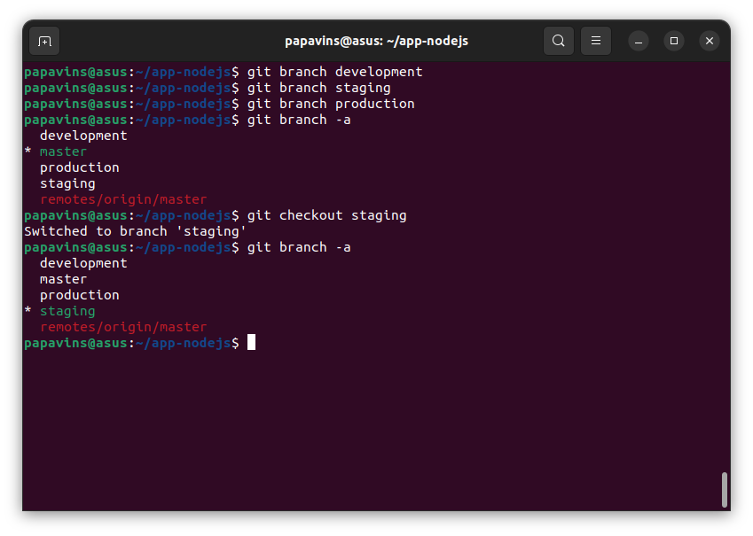

# Day 4

## Version Control System (VCS)

Git adalah salah satu sistem pengontrol versi (Version Control System)
yang telah digunakan oleh para developer untuk dapat mengembangkan
software secara bersamaan pada proyek perangkat lunak

# Contoh Command Git

## Git log

Digunakan untuk meninjau dan membaca riwayat segala sesuatu yang terjadi
pada repositori.

## Git checkout

perintah untuk beralih antar branch yang
ada.

## Membuat environtment Git di Ubuntu

## Konfigurasi user, email dan SSH key

## Step 1

Cek terlebih dahulu apakah git sudah terinstall dengan command `git
--version`

## Step 2

Mengisi email github dan username github dengan command

`Git config --global user.email "\<email github\>"`

`Git config --global user.name "\<username github\>"`

## Step 3

Membuat key SSH dengan command ssh-keygen

## Step 4

Buka file \~/.ssh/id_rsa.pub yang sudah digenerate dari command
ssh-keygen dengan command

`Cat /home/papavins/.ssh/id_rsa.pub`

## Step 5

Buka github.com kemudian pada bagian pojok kanan atas klik profil
kemudian masuk ke menu setting

## Step 6

Pilih SSH dan GPG keys

## Step 7

Isikan title ssh keys dan paste key public yang sudah digenerate tadi

Step 8

Lakukan cek koneksi ke github menggunakan command

`Ssh -T git@github.com`

# Membuat dan mengisi repository dan branch

## Step 1

Masuk ke direktori yang akan diupload kedalam github kemudian buat
folder .git dengan command `git init`

## Step 2

Kemudian buat file .gitignore untuk memilih file atau folder yang tidak
diupload ke github, sebagai contoh disini tidak mengupload folder
node_modules

`Touch .gitignore`

`Echo "node_modules" \> .gitignore`

## Step 3

Tahap berikutnya memilih file yang akan memasuki fase staged dimana file
yang akan diupload untuk di commit ke repository dengan menggunakan
command

`Git add \<folder/file\>`

## Step 4

Selanjutkan Kembali ke web github, pada pojok kanan atas klik ikon
tambah (+) kemudikan pilih new repository

## Step 5

Beri nama repository kemudian creat repository

## Step 6

Kemudian copy key SSH repository yang sudah dibuat

## Step 7

Kembai ke terminal lalu tambahkan remote github dengan key SSH yang
sudah di copy tadi kemudian cek remote yang sudah terdaftar di
repository local menggunakan command

`Git remote add origin \<key SSH github repository\>`

`Git remote -v`

## Step 8

Selanjutnya lakukan commit untuk menulis file kedalam repository local
dengan command

`Git commit -m "first
commit"`

## Step 9

Kemudian lakukan push pada file yang di repository lokal ke repository
github dengan command

`Git push \<remote-name\> \<branch-name\>`

Cek web github bila sudah melakukan push

{width="6.268055555555556in"
height="2.877083333333333in"}

# Step 10

Buat branch development, staging dan production dengan command

`Git branch development`

`Git branch staging`

`Git branch production`

Lalu cek daftar branch `Git branch -a`

Untuk memilih antar branch menggunakan command

`Git checkout \<nama branch\>`

