Day 5

CI/CD dengan Cloudflare Pages

Cloudflare adalah salah satu Content Delivery (CD) yang menyediakan
layanan cloudflare pages, yang digunakan developer untuk kolaborasi
pengembangan front-end dan deploy website .

Deploy aplikasi wayhub-frontend ke Cloudflare Pages menggunakan Github

Step 1

Step pertama lakukan create fork repository wayhub-frontend dengan
membuka repository github
https://github.com/dumbwaysdev/wayshub-frontend

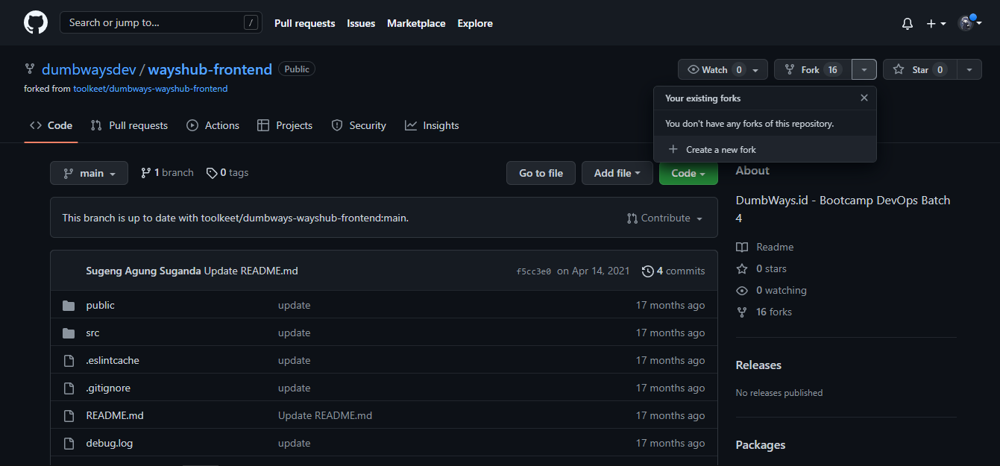{width="6.268055555555556in"
height="2.921527777777778in"}

Step 2

Kemudian isi repository name dan description yang diinginkan, bila sudah
klik create fork

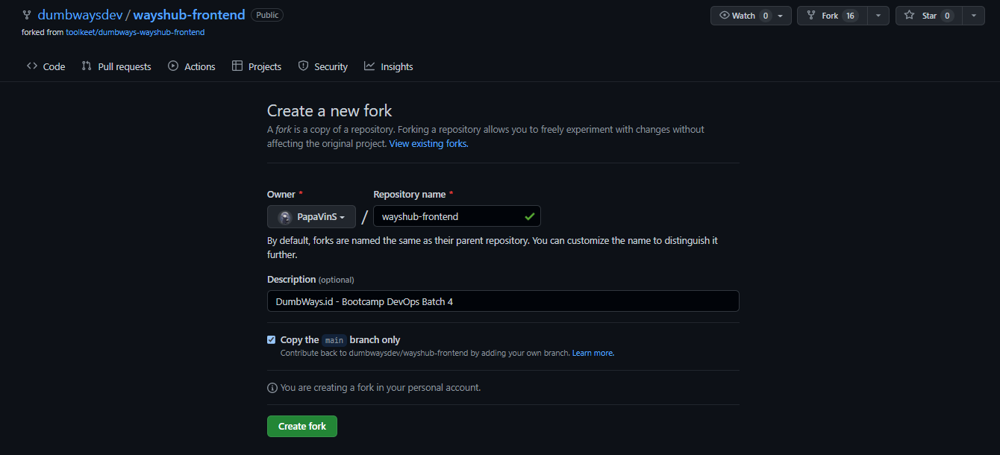{width="6.268055555555556in"
height="2.8534722222222224in"}

Step 3

Langkah berikutnya kita hubungan repository Github dengan Cloudflare
Pages, masuk ke dashboard Cloudflare pilih menu Pages kemudian connect
to Git kemudian Connect Github

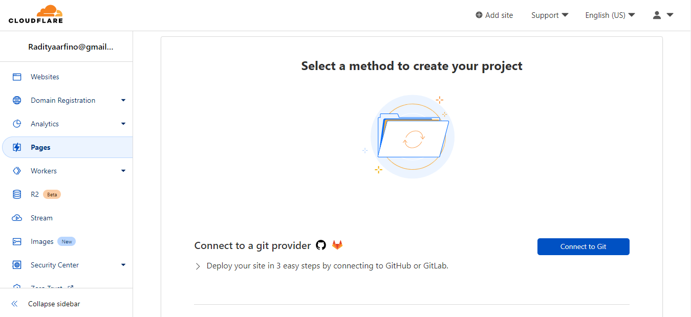{width="6.268055555555556in"
height="2.8784722222222223in"}

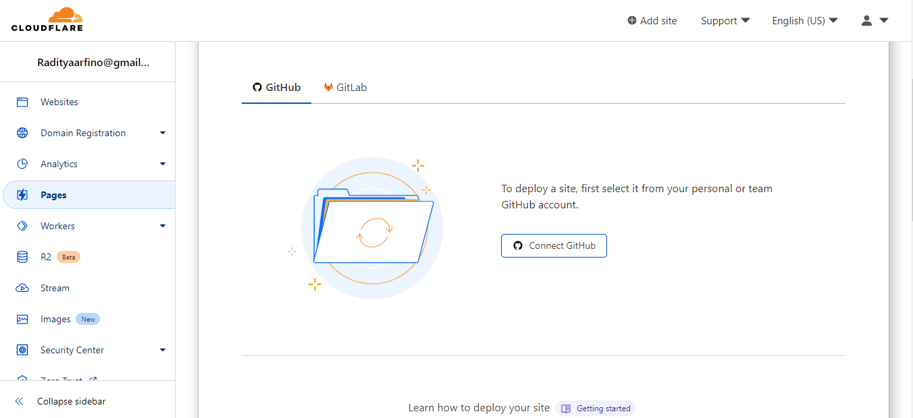{width="6.268055555555556in"
height="2.8743055555555554in"}

Step 4

Pilih repository wayhub-frontend kemudian begin setup

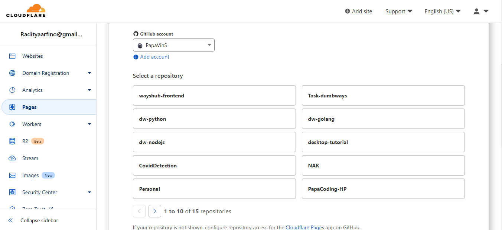{width="6.268055555555556in"
height="2.879166666666667in"}

Isikan project name dan production branch

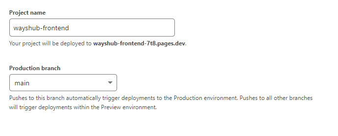{width="6.268055555555556in"
height="2.5347222222222223in"}

Untuk build settings disini kita pilih framework preset "create react
app" kemudian build command "npm run build" terakhir build output
directory /build

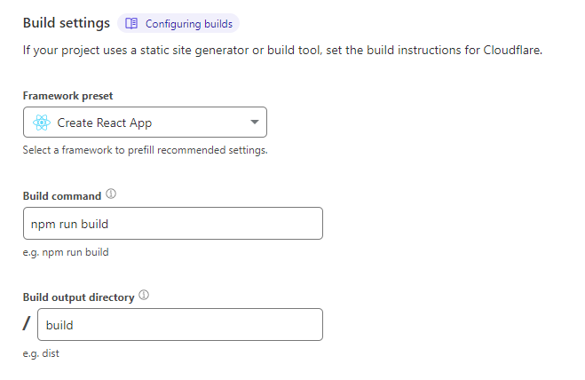{width="6.268055555555556in"
height="4.070833333333334in"}

Tunggu proses building dan deploying selesai

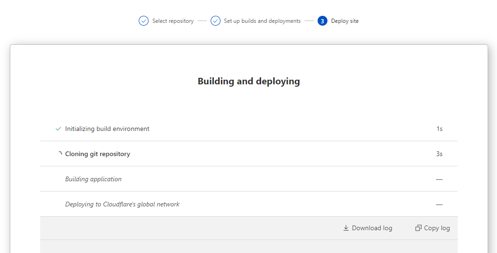{width="6.268055555555556in"
height="3.198611111111111in"}

Bila sudah success kita klik continue to project

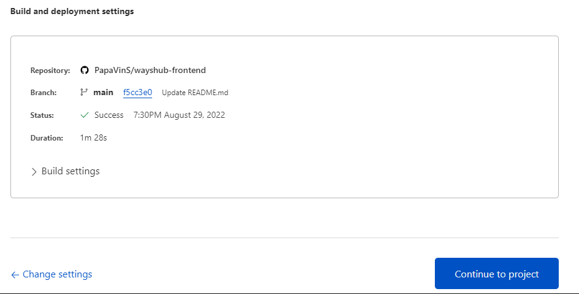{width="6.268055555555556in"
height="3.1805555555555554in"}

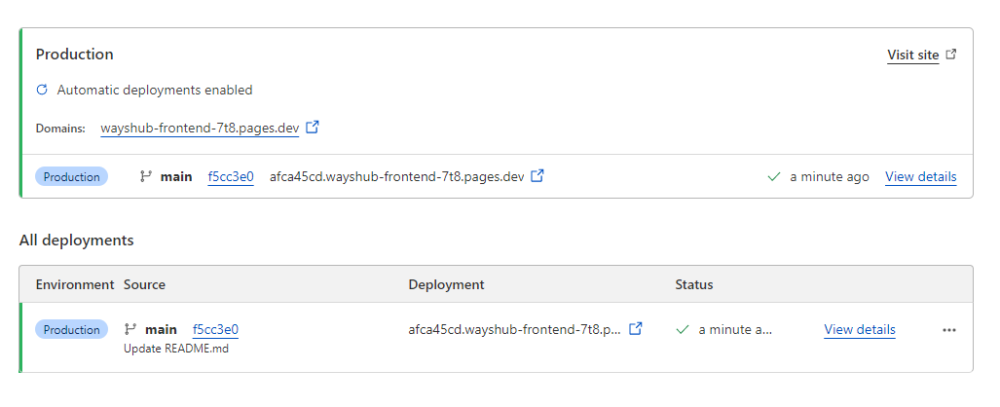{width="6.268055555555556in"
height="2.551388888888889in"}

Kita cek hasil deployment webnya

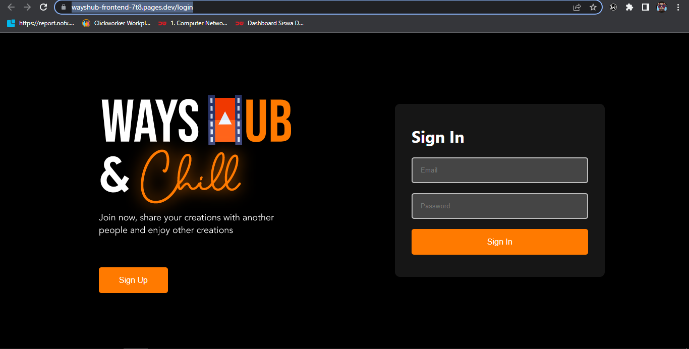{width="6.268055555555556in"
height="3.175in"}

Test CI/CD code aplikasi

Disini kita akan mencoba testing perubahan source code untuk mengecek
apakah CI/CD berjalan dan bisa secara otomatis melakukan deployment

Pertama kita buka repository github wayhub-frontend/public/index.html

{width="4.291666666666667in"
height="0.5416666666666666in"}

Kita coba ganti title web nya

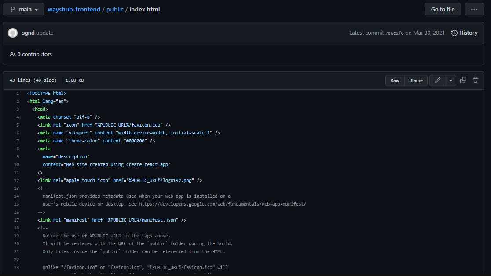{width="6.268055555555556in"
height="3.527083333333333in"}

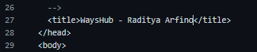{width="3.375in" height="0.6875in"}

Setelah commit change kita cek apakah CI/CD berjalan saat merubah source
code

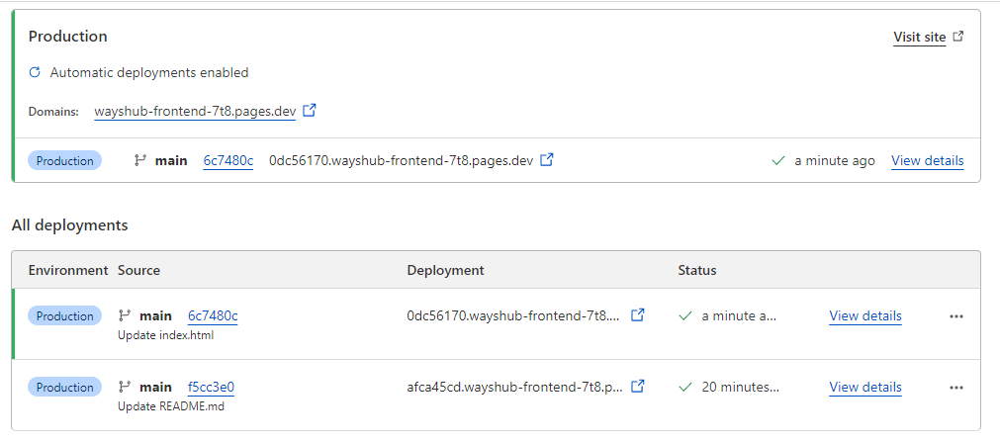{width="6.268055555555556in"
height="2.7777777777777777in"}

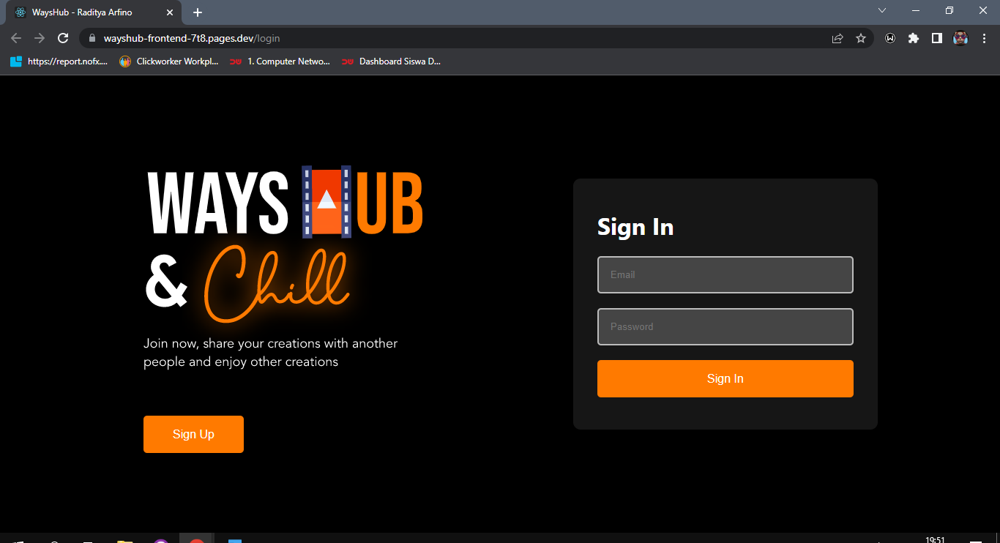{width="6.268055555555556in"
height="3.404861111111111in"}
