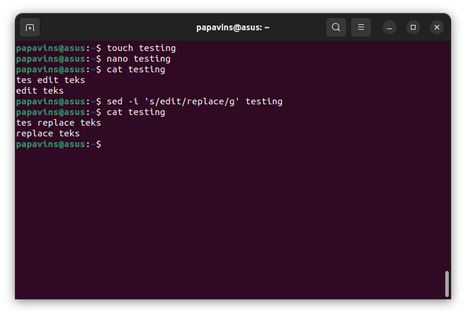

Day 6

Manage server dengan Terminal

Definisi Terminal

Sering disebut command prompt atau shell dengan tampilan antarmuka
berbasis teks CLI (Command Line Interface) yang digunakan untuk
mengoperasikan program, membuat file, mengakses file dan sebagainya.
Dengan menggunakan terminal ada beberapa kelebihannya yaitu:

-   Tidak memakan resource perangkat secara besar

-   Pengoperasiannya lebih cepat

-   Lebih stabil

Command Text Manipulation

cat

yaitu perintah untuk menampilkan ,membuat daftar atau isi suatu file

{width="6.260416666666667in"
height="4.25in"}

{width="6.260416666666667in"
height="4.25in"}

Sed

Perintah sed (stream editor) berfungsi untuk manipulasi teks pada file

{width="6.260416666666667in"
height="4.25in"}

Grep

Perintah grep berfungsi untuk mencari text tertentu pada file

{width="6.260416666666667in"
height="4.25in"}

{width="6.260416666666667in"
height="4.25in"}

Sort

Digunakan untuk sorting atau mengurutkan text pada file

{width="6.260416666666667in"
height="4.25in"}

Echo

Digunakan untuk menampilkan text di terminal

{width="6.260416666666667in"
height="4.25in"}

Fmt

perintah fmt membaca isi dari file yang ditentukan setelah itu disusun
kembali sesuai dengan format yang ditentukan, ke perangkat output
standar.

{width="6.260416666666667in"
height="4.25in"}

Membuat script bash update dan upgrade serderhana

Step 1

Kita buat file baru kemudian isi script sebagai berikut

#!/bin/bash

sudo apt-get -y update

sudo apt-get -y upgrade

{width="6.260416666666667in"
height="4.25in"}

Step 2

Beri permission to execute file terlebih dahulu dengan command chmod

chmod +x \<file-name\>

{width="6.260416666666667in"
height="4.25in"}

Step 3

Terakhir tinggal kita run script dengan command

Bash \<nama file\> atau bisa menggunakan ./\<nama file\>

{width="6.260416666666667in"
height="4.25in"}

Membuat script bash firewall port 22, 88 dan 443

Step 1

Kita buat file script terlebih dahulu touch firewall.sh kemudian nano
firewall.sh untuk membuka text editor kemudian masukkan script berikut

#!/bin/bash

sudo ufw allow ssh

sudo ufw allow http

sudo ufw allow https

yes \| sudo ufw enable

{width="6.260416666666667in"
height="4.25in"}

Step 2

Lalu tambahkan permission execute file dengan comman chmod +x \<nama
file\>

Selanjutnya script bisa dijalankan bash \<nama file\> atau ./\<nama
file\>

{width="6.260416666666667in"
height="4.25in"}

Aplikasi monitoring

Htop

Interactive system monitor dan process manager

{width="6.260416666666667in"
height="3.59375in"}

Arti dari color bars

CPU color bars:

-   Dark blue : menandakan persentase CPU yang digunakan oleh low
    priority processes

-   Green : menampilkan running process yang digunakan oleh user dalam
    system

-   Red : menampilkan kernel threads

-   Aqua blue : menampilkan virtualized process

Memory color bars:

-   Green : menampilkan memori yang sedang digunakan

-   Dark blue : menampilkan memory buffer pages

-   Orange : menampilkan memory yang dialokasikan di cache

Nmon

Nigel performance monitor adalah aplikasi yang berfungsi memonitor
performa system yang dikembangkan oleh IBM dan Linux

Untuk instalasinya bisa menggunakan sudo apt install nmon kemudian
menjalankannya run nmon

{width="6.260416666666667in"
height="3.59375in"}{width="6.260416666666667in"
height="3.59375in"}

Ps

Atau process status yang berfungsi menampilkan informasi proses yang
berjalan

ps -f -u \<nama user\> untuk menampilkan proses yang berjalan di user
tertentu

{width="6.260416666666667in"
height="3.59375in"}

Bila ingin menampilkan proses yang berjalan di system bisa menggunakan
command ps-aux

{width="6.260416666666667in"
height="3.59375in"}

Lsof

List all open files untuk menampilkan seluruh file yang berjalan di
background

{width="6.260416666666667in"
height="3.59375in"}

Bila ingin menampilkan file yang berjalan di user tertentu bisa
menggunakan lsof -u \<nama user\>

{width="6.260416666666667in"
height="3.59375in"}
