Day 7

Web Server

Web server adalah perangkat lunak untuk memproses permintaan data, atau
informasi yang pengguna masukkan dengan menerima HTTP atau HTTPS dari
web browser, contohnya bila kita ingin mengakses website dumbways dengan
mengetik alamat [https://dumbways.id](https://dumbways.id/) lewat web
browser maka web server akan mengirimkan halaman website yang diminta.

Reverse Proxy dan Load Balancing

Membuat instance di Multipass

Step 1

Untuk kelengkapan yang saya gunakan, disini saya gunakan ubuntu
desktop/localhost saya sebagai gateway yang akan digunakan untuk pintu
akses dari 2 instance mulltipass server aplikasi.

Pertama kita install web server nginx nya dengan menjalankan perintah
sudo apt install
nginx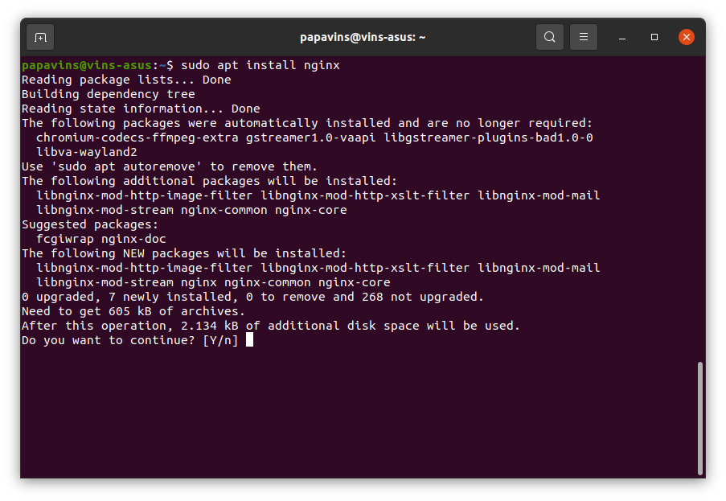{width="6.260416666666667in"
height="4.322916666666667in"}

Setelah instalasi, kita cek lagi apakah sudah benar terinstal dengan
nginx -v dan sudo systemctl status
nginx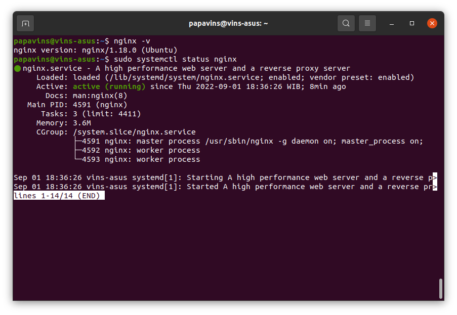{width="6.260416666666667in"
height="4.322916666666667in"}

Step 2

Berikutnya kita install multipass nya dengan command sudo snap install
multipass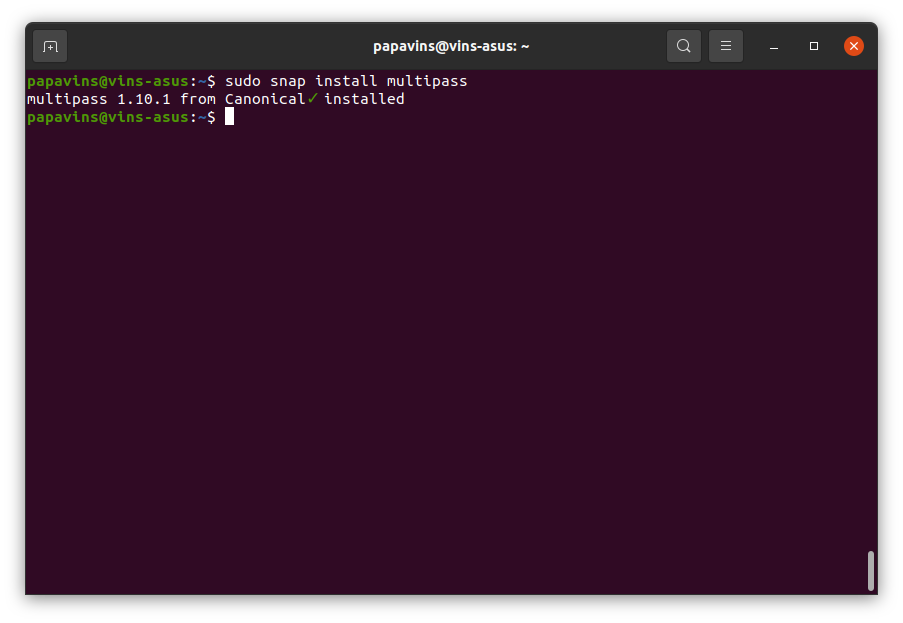{width="6.260416666666667in"
height="4.322916666666667in"}

Setelah itu kita buat 2 instance di multipass dengan command multipass
launch --name \<nama
instance\>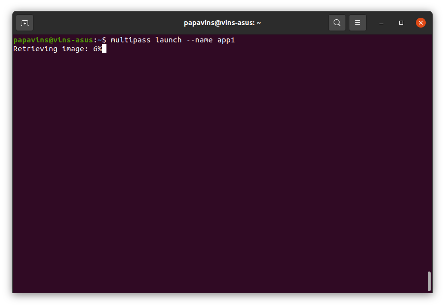{width="6.260416666666667in"
height="4.322916666666667in"}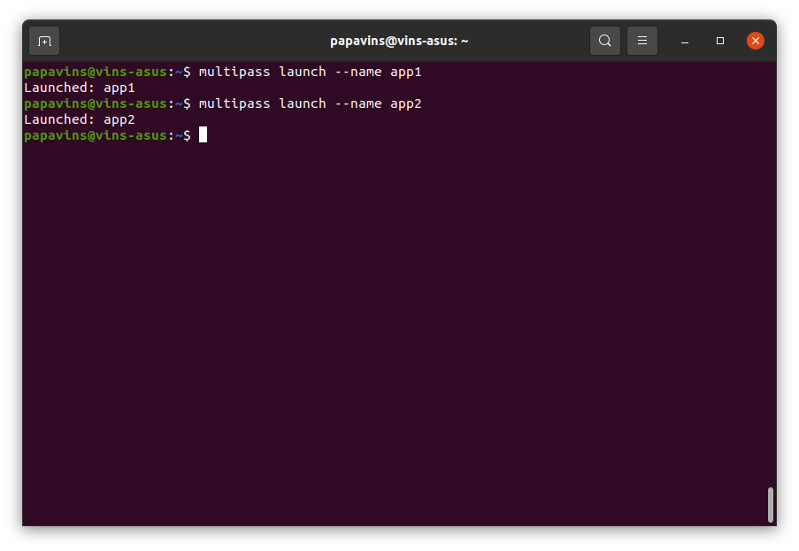{width="6.260416666666667in"
height="4.322916666666667in"}

Jika sudah membuat 2 instance multipass, bisa kita cek status dan IP
address kedua instance tersebut untuk selanjutnya nani dapat melalukan
reverse proxy dan load balancing.

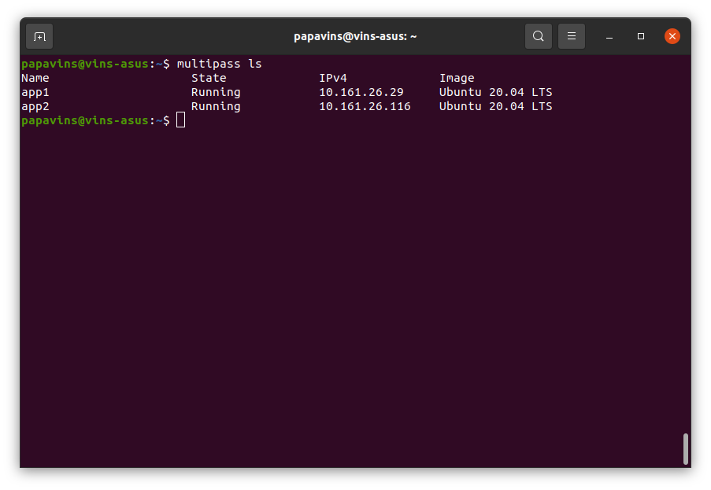{width="6.260416666666667in"
height="4.322916666666667in"}

Disini saya akan mencoba mengakses salah satu instance multipass server
aplikasi *app1* yang saya buat tadi menggunakan command multipass shell
app1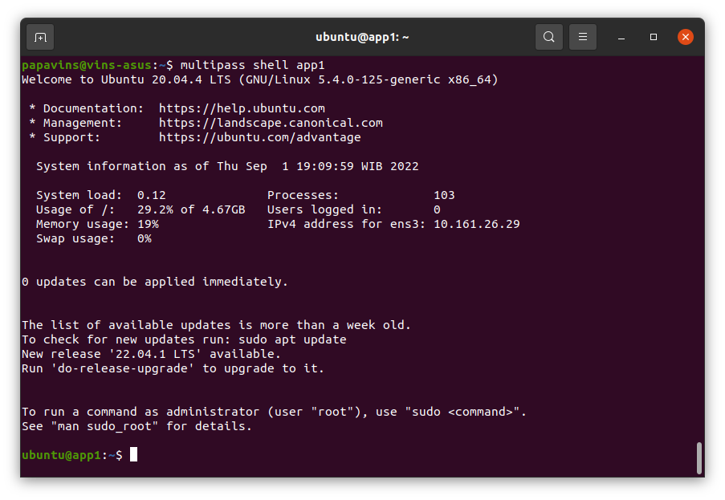{width="6.260416666666667in"
height="4.322916666666667in"}

Kemudian kita lakukan pull repositoy aplikasinya disini saya mengambil
dari github saya git clone
<https://github.com/PapaVinS/wayshub-frontend>

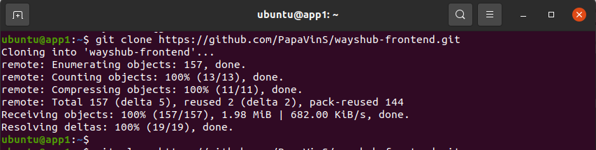{width="6.260416666666667in"
height="1.5833333333333333in"}

dan instalasi nvm curl -o-
https://raw.githubusercontent.com/nvm-sh/nvm/v0.39.1/install.sh \| bash

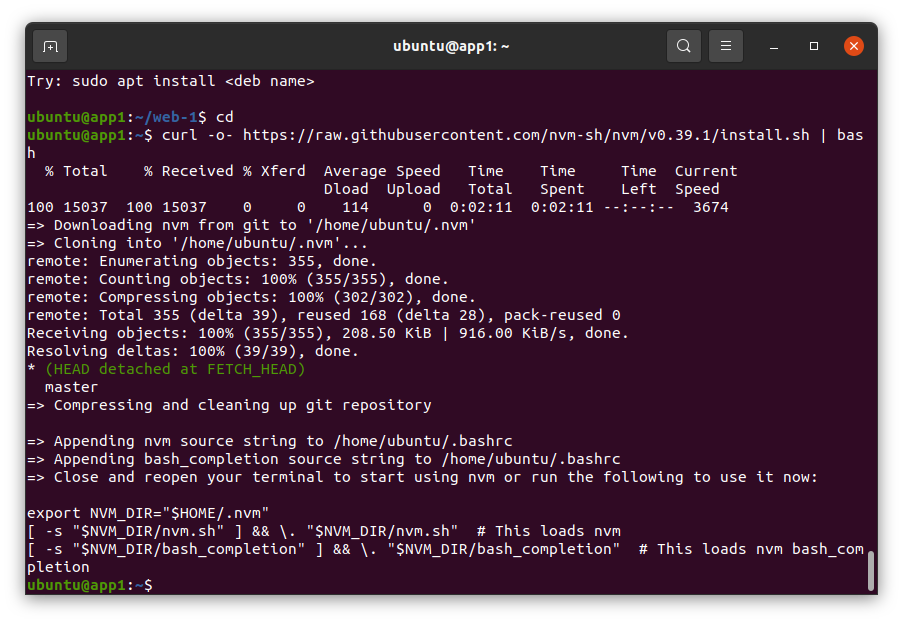{width="6.260416666666667in"
height="4.322916666666667in"}

Jalankan nvm install, bila sudah terinstall kita cek lagi dengan nvm -v
node -v npm
-v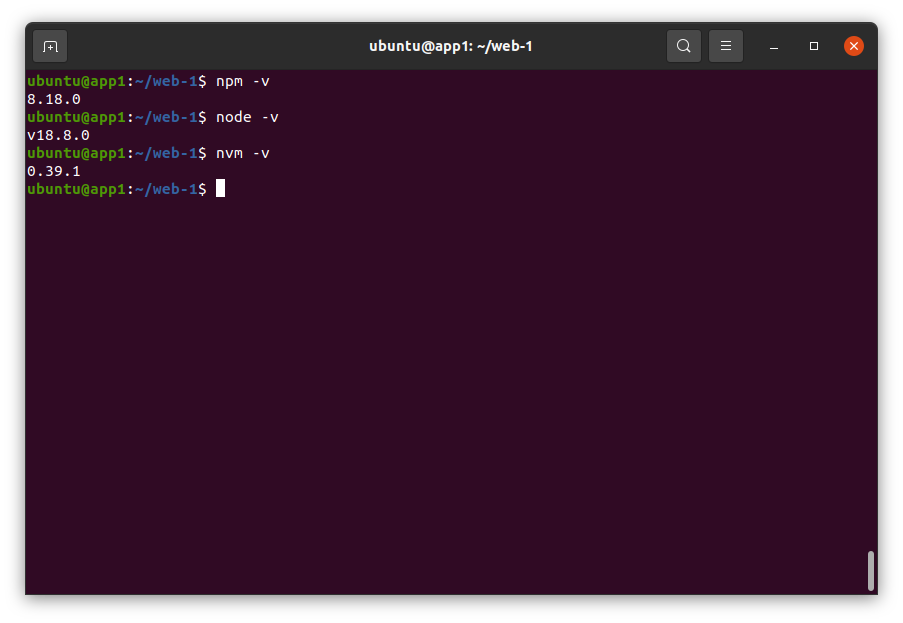{width="6.259722222222222in"
height="4.325in"}

Lalu kita jalan npm install didalam repository yang sudah kita pull
tadi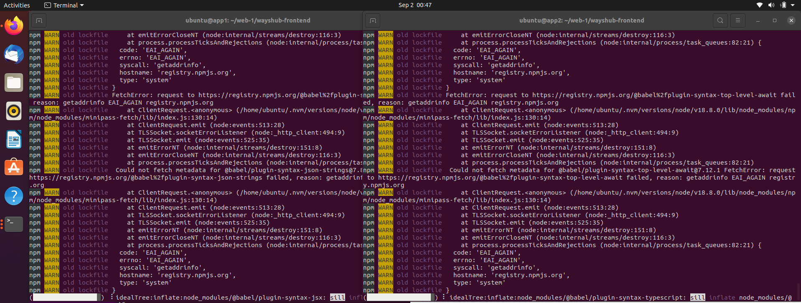{width="6.246527777777778in"
height="2.363888888888889in"}

Disini saya sarankan untuk instalasi npm di folder aplikasi, untuk
mematikan atau stop salah satu instance agar proses instalasi cepat dan
proses instalasi tidak hang/crash

Step 3

Untuk menjalankan proses server di background maka kita membutuhkan PM2.
Kita install dengan command npm install pm2@latest -g

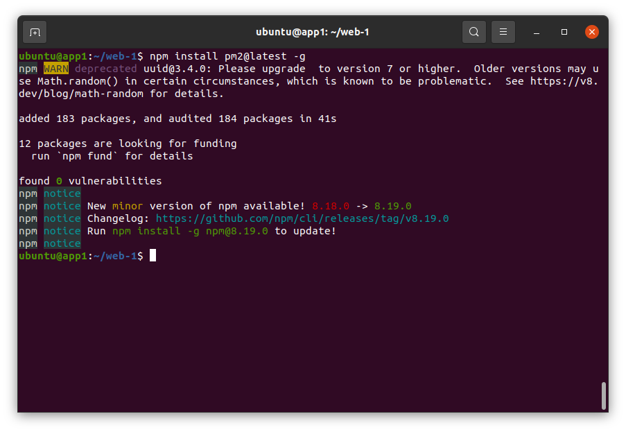{width="6.259722222222222in"
height="4.325in"}

Bila semua step sudah dilakukan, lakukan step yang sama di instance
multipass kedua. Kesimpulannya kita sudah memiliki server gateway yang
menggunakan nginx, server aplikasi front-end dengan nodejs sudah
terinstall dikedua instance multipass dan PM2 sebagai process
managernya.

Setup Reverse Proxy

Reverse proxy merupakan sebuah fitur di dalam sebuah webserver, yang
berfungsi untuk melakukan port forwarding suatu request, dari public
request menuju ke dalam sistem.

Step 1

Pertama kita pindah direktori ke folder nginx dengan command cd
/etc/nginx kemudian buat directory baru, disini saya contohkan dengan
sudo mkdir dumbways dan kita buat file config reverse proxynya
menggunakan sudo nano my.reverse-proxy.conf, setelah itu kita buka text
editor sudo nano my.reverse-proxy.conf kemudian isikan source codenya
dibawah ini

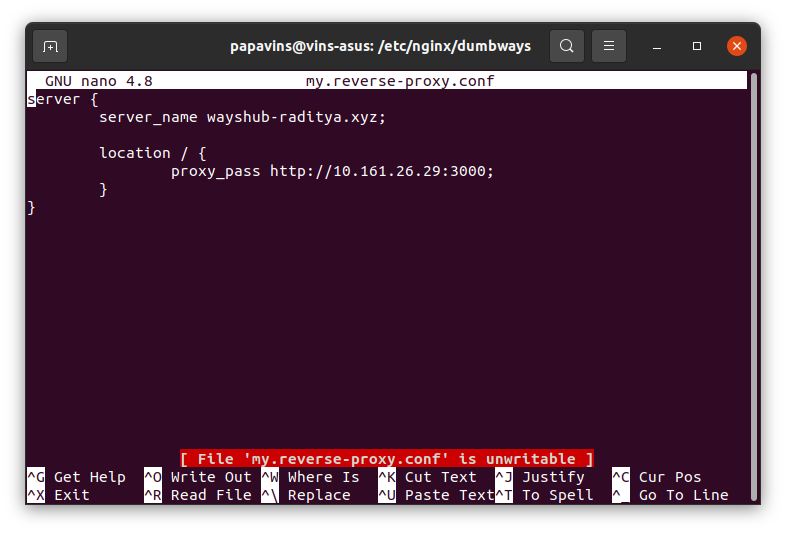{width="6.259722222222222in"
height="4.246527777777778in"}

Bila sudah di save kita keluar dari direktori dumbways kemudian kita
include config reverse proxy yang sudah kita buat tadi dengan membuka
nginx.conf dengan sudo nano nginx.conf lalu dibagian virtual host config
kita tambahkan include
/etc/nginx/dumways/\*;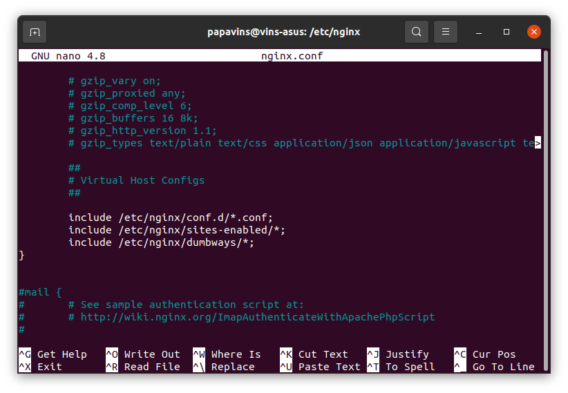{width="6.267361111111111in"
height="4.3375in"}

Jika sudah kita cek status config nginx apakah sudah benar denga command
sudo nginx -t

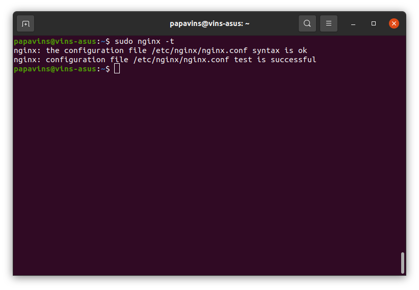{width="6.267361111111111in"
height="4.3375in"}

Berikutnya kita start PM2 untuk testing apakah nginx berjalan, kita
masuk kedalam instance multipass app1 lalu masukkan command pm2 start
npm \--name \"wayshub\" \--
start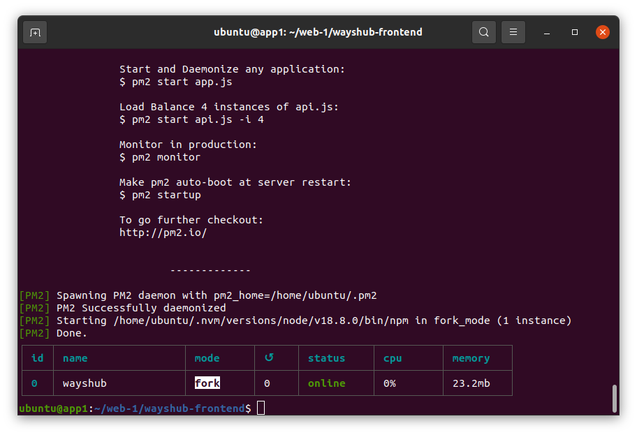{width="6.2555555555555555in"
height="4.279166666666667in"}

Jika sudah semua maka halaman web dapat diakses dengan nama domain
kemudian instance app1 sudah terhubung dengan gateway dan instance app1
menjalankan npm menggunakan PM2.

Load Balancing

Kita masuk ke step load balancing, load balancing adalah proses
pendistribusian traffic jaringan ke beberapa server. Ini untuk
memastikan salah satu server tidak menanggung terlalu banyak beban

Kita akses direktori etc/nginx/dumbways kemudia kita buat file config
baru dengan nama loadbalance.conf. kemudian kita isi nama variable
disini saya beri nama akaboshi dengan IP address kedua instance lalu
nama server saya beri lb.wayshub-raditya.xyz dan proxy pass
http://akaboshi

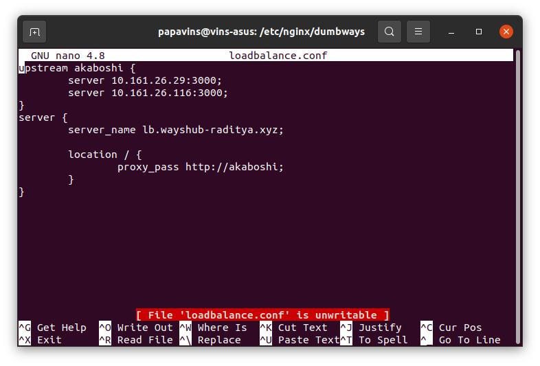{width="6.267361111111111in"
height="4.2444444444444445in"}
