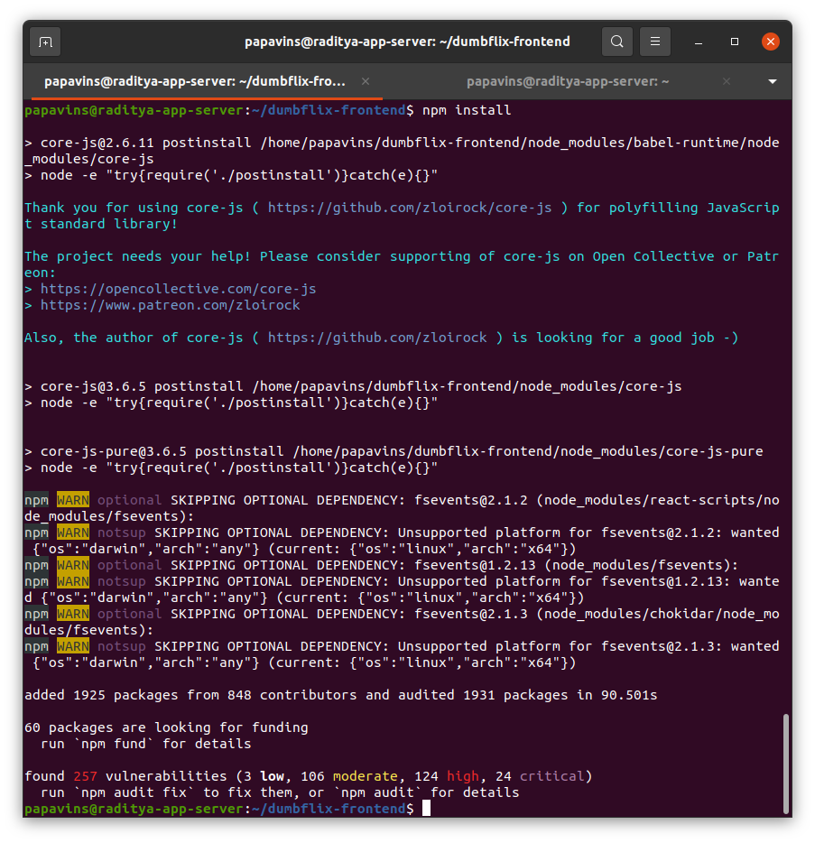
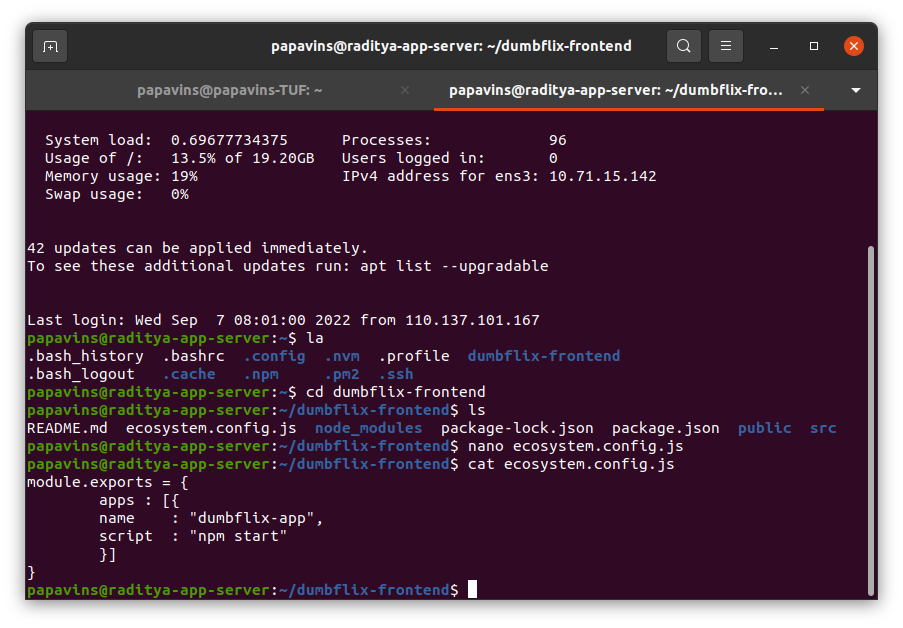

Day 1

Cloud Computing

Definisi Cloud Computing berarti menyimpan dan mengakses data dan
program melalui internet dari lokasi berbeda atau menggunakan komputer
dari hard drive komputer kita. Fungsinya memudahkan penggunanya untuk
menjalankan program tanpa harus menginstall aplikasi terlebih dahulu dan
memudahkan pengguna untuk mengakses data dan informasi melalui internet.

Membuat instance/VM untuk server aplikasi di IDCloudhost

Step 1

Kita akses dan login ke dashbord console IDCloudhost terlebih dahulu
<https://console.idcloudhost.com/>

{width="6.259722222222222in"
height="3.1625in"}

Step 2

Dibagian menu bar sebelah kiri kita pilih compute kemudian klik new

{width="5.188888888888889in"
height="5.043055555555555in"}

Step 3

Setelah itu akan muncul tab baru New Resource, kita pilih spesifikasi
instance nya

{width="5.401459973753281in"
height="3.7439009186351706in"}

Isikan username, password, SSH (bila digunakan), resource name kemudian
klik create.

{width="5.496350612423447in"
height="2.584796587926509in"}

Step 4

Bila proses pembuatan selesai akan muncul tab instance yang sudah kita
buat tadi.

{width="6.260416666666667in"
height="4.404861111111111in"}

Cara generate RSA key SSH

Agar kita bisa mengakses instance server aplikasi kita secara remote
membutuhkan RSA key SSH sebagai kunci akses, untuk pembuatannya kita
perlu men-generate RSA key dahulu.

Kita gunakan command ssh-keygen

{width="6.260416666666667in"
height="4.363888888888889in"}

Setelah generate, kita copy key id_rsa.pub ke server aplikasi scp
.ssh/ide_rsa.pub \<user\>@\<IP Instance\>:\~/.ssh

{width="6.260416666666667in"
height="4.363888888888889in"}

Kemudian kita masukkan isi id_rsa.pub ke file authorized_keys

Cat id_rsa.pub \>\> authorized_keys

{width="6.260416666666667in"
height="4.363888888888889in"}

Jika sudah kita coba login menggunakan private key SSH

Ssh -- i .ssh/id_rsa \<user\>@\<IP Server\>

{width="6.260416666666667in"
height="4.363888888888889in"}

Install aplikasi dumbflix dan PM2

Step 1

Kita install nvm dan npm version 10

curl -o- https://raw.githubusercontent.com/nvm-sh/nvm/v0.39.1/install.sh
\| bash

nvm install 10

{width="6.260416666666667in"
height="3.5083333333333333in"}

{width="6.260416666666667in"
height="3.5083333333333333in"}

Step 2

Selanjutnya install PM2

npm install -g pm2

{width="6.260416666666667in"
height="3.5083333333333333in"}

Step 3

Kita clone repository aplikasi dumbflix di github git clone
https://github.com/dumbwaysdev/dumbflix-frontend.git

{width="6.2659722222222225in"
height="4.1097222222222225in"}

Step 4

Jika sudah terclone, kita masuk ke direktori aplikasi kemudian kita
install npm

cd dumbflix-frontend/

npm install

{width="6.2659722222222225in"
height="6.479861111111111in"}

Step 5

Kita create file script PM2 menggunakan pm2 init simple

{width="6.2659722222222225in"
height="6.23125in"}

Step 6

Kita ubah isi file ecosystem.config.js menjadi

Name : "dumbflix-app",

Script : "npm start"

{width="6.2659722222222225in"
height="4.358333333333333in"}

Step 7

Kemudian kita jalankan scriot PM2 ecosystem tadi menggunakan

pm2 start ecosystem.config.js

{width="6.260416666666667in"
height="4.584027777777778in"}

Setelah itu coba kita cek di web browser apakah sudah berjalan.

{width="6.254166666666666in"
height="3.566666666666667in"}

Setup DNS Cloudflare dan Reverse Proxy Nginx

Step 1

Kita buat instance lagi yang nantinya digunakan untuk nginx dengan
spesifikasi yang sama

{width="6.260416666666667in"
height="4.346527777777778in"}

Terus kita coba akses login ke server nginx nya

{width="6.2659722222222225in"
height="5.479861111111111in"}

Step 2

Kita login dan masuk ke dashboard cloudflare kemudian di bagian menu
kiri atas kita pilih
DNS{width="2.7916666666666665in"
height="4.127083333333333in"}

Setelah itu kita klik add record kemudian kita isi nama dns nya dan Ipv4
address kita isi IP server nginx kita

{width="6.254166666666666in"
height="2.7979166666666666in"}

Step 3

Setelah itu kita install nginx di dalam server sudo apt-get update

sudo apt-get install nginx

{width="6.2659722222222225in"
height="5.479861111111111in"}{width="6.2659722222222225in"
height="2.479861111111111in"}

Step 4

Kemudian kita buat file konfigurasi untuk reverse proxynya, disini kita
buat di folder

sudo nano /etc/nginx/sites-enabled/rp-dumbflix.conf

lalu isikan script berikut kemudian save

server{

server_name \<url-domain\>;

location / {

proxy_pass http://\<ip-server\>:\<port\>;

}

}

{width="6.254166666666666in"
height="2.057638888888889in"}

Step 5

Kita cek konfigurasi reverse proxy tadi apakah sudah sukses

{width="6.2659722222222225in"
height="4.433333333333334in"}

Step 6

Coba kita cek url domain di dalam web browser

{width="6.254166666666666in"
height="3.566666666666667in"}
